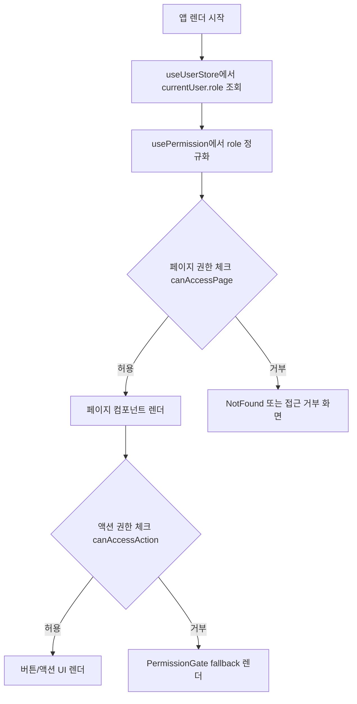

# 🔐 권한 플로우 문서

이 문서는 현재 프로젝트에서 구현된 **전체 권한 흐름(페이지 접근 + 버튼/액션 권한)** 을 설명합니다.

---

## 📋 목차

1. [권한 시스템 개요](#1-권한-시스템-개요)
2. [핵심 구성 파일](#2-핵심-구성-파일)
3. [전체 실행 플로우](#3-전체-실행-플로우)
4. [페이지 접근 권한 플로우](#4-페이지-접근-권한-플로우)
5. [버튼/액션 권한 플로우](#5-버튼액션-권한-플로우)
6. [권한 추가/변경 가이드](#6-권한-추가변경-가이드)
7. [운영 시 체크리스트](#7-운영-시-체크리스트)

---

## 1. 권한 시스템 개요

현재 권한 모델은 RBAC(Role-Based Access Control) 기반입니다.

- 역할(Role): `admin`, `editor`, `viewer`
- 페이지 권한(Page Permission): `home`, `post-list`, `admin`
- 액션 권한(Action Permission): `post:create`, `post:filter`, `post:delete`, `button:export`

핵심 원칙:

- 라우트 진입은 **페이지 권한**으로 제어
- UI 요소(버튼 등)는 **액션 권한**으로 제어
- 권한 판단은 `usePermission` 훅 한 곳에서 수행

---

## 2. 핵심 구성 파일

### 2.1 권한 타입 정의

- `src/entities/user/lib/permission/types.ts`

정의 항목:

- `TRole`
- `TPagePermission`
- `TActionPermission`
- `TPermissionSet`

### 2.2 역할별 권한 매트릭스

- `src/entities/user/lib/permission/config.ts`

역할별로 `pages`, `actions`를 매핑합니다.

### 2.3 권한 계산 훅

- `src/entities/user/lib/permission/usePermission.ts`

제공 함수:

- `canAccessPage(permission)`
- `canAccessAction(permission)`
- `role`

### 2.4 사용자 상태 저장소

- `src/entities/user/model/userStore.ts`

`currentUser.role`을 기준으로 권한을 계산합니다.

### 2.5 페이지 접근 가드 적용

- `src/routes/home.tsx`

`canAccessPage("home")` 실패 시 `NotFoundPage`로 우회합니다.

### 2.6 버튼/액션 가드 적용

- `src/shared/ui/permission-gate/index.tsx`
- `src/pages/home/ui/Home.tsx`

`PermissionGate`에 `allow`와 `fallback`을 전달해 버튼 노출/비노출 또는 비활성 UI를 처리합니다.

---

## 3. 전체 실행 플로우

---

## 4. 페이지 접근 권한 플로우

예시: `src/routes/home.tsx`

1. 라우트 컴포넌트에서 `usePermission()` 호출
2. `canAccessPage("home")` 실행
3. `false`면 `NotFoundPage` 반환
4. `true`면 실제 페이지 반환

장점:

- 라우트 단에서 선제 차단
- 페이지 컴포넌트에 불필요한 분기 감소

---

## 5. 버튼/액션 권한 플로우

예시: `src/pages/home/ui/Home.tsx`

1. `usePermission()`으로 `canAccessAction` 획득
2. 각 버튼을 `PermissionGate`로 감쌈
3. 권한 없으면 `fallback` 렌더링

`PermissionGate` 사용 패턴:

- `allow={canAccessAction("post:create")}`
- `fallback={<button disabled>글 생성 불가</button>}`

장점:

- 권한 없는 사용자에게 명확한 피드백 제공
- 버튼별 정책을 선언적으로 관리 가능

---

## 6. 권한 추가/변경 가이드

### 6.1 새 페이지 권한 추가

1. `types.ts`의 `TPagePermission`에 값 추가
2. `config.ts`에서 각 역할의 `pages` 배열에 반영
3. 해당 라우트에서 `canAccessPage("새권한")` 적용

### 6.2 새 액션 권한 추가

1. `types.ts`의 `TActionPermission`에 값 추가
2. `config.ts`에서 각 역할의 `actions` 배열에 반영
3. UI에서 `PermissionGate + canAccessAction("새권한")` 적용

### 6.3 새 역할 추가

1. `types.ts`의 `TRole`에 값 추가
2. `config.ts`의 `rolePermissions`에 동일 키 추가
3. 로그인/유저 초기화 로직에서 해당 role 세팅

---

## 7. 운영 시 체크리스트

- 클라이언트 권한 체크는 UX 보완용이며, 서버 권한 검증은 별도로 반드시 수행
- API 요청(생성/삭제/수정)은 서버에서도 role/permission 재검증
- `role`이 유효하지 않은 경우 기본적으로 거부(`false`) 처리
- 권한 변경 시 라우트 가드와 버튼 가드가 모두 반영되었는지 확인
- 테스트 케이스는 최소 `admin/editor/viewer` 3역할 기준으로 작성

---

## 부록: 현재 기본값

현재 저장소 기본 유저는 `viewer`입니다.

- 위치: `src/entities/user/model/userStore.ts`
- 기본 상태: `currentUser = { id: "demo-user", role: "viewer" }`

즉, 기본 실행 시:

- `home` 페이지 접근은 허용
- `post:create`, `button:export`는 거부(fallback 버튼 표시)
